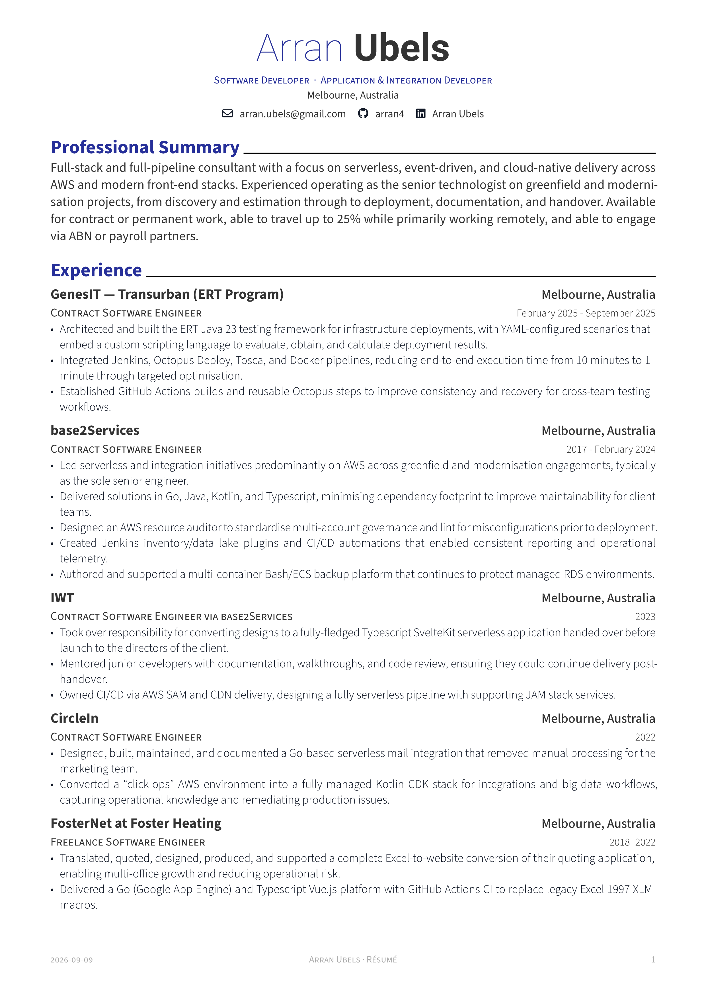

# Arran Ubels Resume




This is my attempt at a public resume / cv. An unabridged version, abridged versions might be discoverable in snapshots. If you have any suggestions, issues, and the like please raise an issue or a PR. Why else would I do this in git. 

You can download the latest compiled version (in PDF form) from:

https://github.com/arran4/resume/releases

Or build it yourself, you will need to install `typst` on your platform. Details on how to do that can be found here:

## Installing Typst

> **Note:** Reproducing the CI rendering requires exactly **Typst 0.15.1**. You can verify your version by running:
> ```bash
> typst --version
> ```

1. Visit <https://typst.app/docs/install/> and follow the steps for your operating system.
   - **macOS**: `brew install typst`
   - **Linux**: use your distribution's package manager if available:
     `apt install typst` (Debian/Ubuntu), `dnf install typst` (Fedora),
     `pacman -S typst` (Arch). If no package exists, run the official
     install script:

     ```bash
     curl --proto '=https' --tlsv1.2 -sSf https://typst.app/install.sh | sh
     ```
   - **Windows**: `winget install Typst.Typst` (via the Windows Package
     Manager) or download the release from GitHub.
2. Ensure the `typst` command is available in your `PATH`.

## Building the resume

Run the following commands from the repository root to generate the PDF and PNG outputs:

```bash
# Generate PDF and PNGs locally (uses the same script as CI)
./build.sh
```

> **Determinism:** `build.sh` automatically exports `SOURCE_DATE_EPOCH` based on the timestamp of the latest git commit that affected `resume.typ`. This removes wall-clock time as a document input, ensures that preview-image-only commits do not incorrectly advance the document's date, and guarantees reproducible bit-for-bit rendering of the PDF and exact byte-for-byte reproducibility of PNG assets for any given revision.

This will create `resume.pdf` along with page images in the current directory.

Typst will automatically fetch dependencies (such as **`modern-cv` version 0.10.0** from the Typst Universe) based on the authoritative `#import` statements in `resume.typ`. When compiling
for the first time, ensure you have network access so the
packages can be downloaded via Typst's package manager.

> **Important:** Compiling requires the local fonts. The `build.sh` script automatically sets `TYPST_FONT_PATHS=./fonts` to ensure the local fonts are loaded.

### Updating the Toolchain and Dependencies

When upgrading Typst or `modern-cv`, ensure all parts of the workflow remain in sync:

1. Update the pinned `typst-version` in `.github/workflows/typst.yaml`.
2. Update the `#import` version for `modern-cv` inside `resume.typ`.
3. Update the documented versions in this `README.md`.

GitHub release tags (`v*`) are the documented project and release version source of truth.

This project is source-available for reference purposes only. Please do not redistribute or reuse the content without permission. However, feel free to copy the github actions code for compiling on tagging:

https://github.com/arran4/resume/blob/main/.github/workflows/typst.yaml

For suggestions / updates etc, please create a fork and then from there create a PR. 
